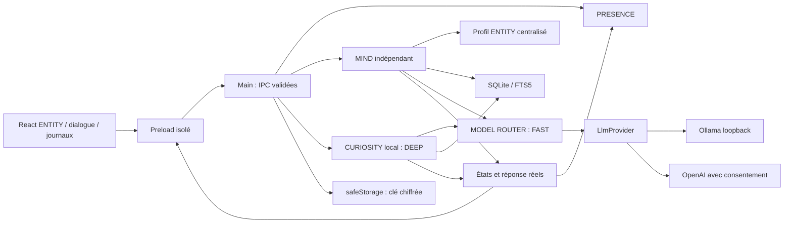

# Architecture AETHER — jalon 3

## Périmètre et découpage

PRESENCE affiche et manipule ENTITY. MIND orchestre le dialogue et fournit la réponse du modèle. MEMORY conserve seulement des souvenirs choisis. CURIOSITY construit un journal intellectuel persistant avec une autonomie locale autorisée et bornée. MODEL ROUTER centralise FAST/DEEP/VISION. EVOLUTION, ECHO, portail/SPACE et voix restent des contrats sans implémentation ni processus actif.

```text
apps/desktop/main       Adaptateurs Electron, fenêtres, IPC, coffre de secrets
apps/desktop/preload    Méthodes nommées, sans API générique d’exécution
apps/desktop/renderer   ENTITY, échange, réglages, MEMORY, journal CURIOSITY
packages/core          PRESENCE, géométrie, préférences, événements
packages/mind          Orchestration, profil ENTITY, router, fournisseurs, configuration
packages/memory        Politique de mémorisation, SQLite et recherche FTS5
packages/curiosity     Sélection, ordonnanceur, budgets, validation, repository
packages/shared        Contrats de dialogue, mémoire, états et extensions
tests                  Tests Node et vraie recette Electron/Ollama
scripts                Compilation, lancement, packaging, transcription CDC
docs                   CDC, sécurité, recettes des jalons
```

Monorepo npm, sans infrastructure supplémentaire. MIND n’importe ni Electron ni React ; MEMORY ne connaît pas l’interface. `MindMemory` et `LlmProvider` permettent de remplacer stockage et fournisseur. Les ports `DialogueInputPort` / `DialogueOutputPort` préparent une future entrée/sortie vocale. Aucun microphone, synthèse, outil ou agent n’est exécuté au J2.

## Flux et frontières de confiance



Le main possède les données et les clients IA. Le rendu ne lit aucun fichier et ne reçoit jamais une clé déjà enregistrée. La saisie initiale utilise un champ mot de passe vidé à l’enregistrement ; la valeur traverse une commande dédiée puis le main la chiffre. La configuration publique expose seulement `keyConfigured` et la disponibilité du coffre.

Chaque IPC doit provenir d’une des cinq fenêtres connues, de son frame principal et d’une URL autorisée. Messages : dialogue seulement ; configuration IA/router : réglages seulement ; mutations/export MEMORY : fenêtre MEMORY ; mutations des objets/domaines CURIOSITY : journal seulement ; budget : journal/réglages. Charges utiles validées, tailles bornées, champs inconnus refusés. Le preload ne donne accès ni à `ipcRenderer`, ni à un canal, script ou chemin arbitraire.

Chromium reste sandboxé, avec isolation du contexte et sans Node. Navigation, popups, webviews et permissions média sont refusés. Aucun réseau depuis le rendu en production ; Vite autorise seulement son origine loopback exacte en développement. Les fournisseurs utilisent Node dans le main. Ollama accepte uniquement une origine HTTP loopback, sans identifiant, chemin, query ni redirection. OpenAI utilise le SDK officiel, Responses, `store:false`, une clé disponible et un consentement explicite aux messages et souvenirs pertinents. Ce paramètre ne garantit pas à lui seul une rétention nulle par le fournisseur.

## PRESENCE et dialogue

ENTITY conserve sa fenêtre transparente, fixe, nominalement 160 × 160 DIP, sans cadre ni ombre native, hors barre des tâches, au-dessus des fenêtres ordinaires. Le rectangle natif peut être arrondi à 160–164 DIP sur le poste à 150 % ; les déplacements réaffirment la taille pour empêcher sa croissance. Aucun plein écran transparent.

Le main mesure le curseur pour le disque interactif de rayon 49 DIP ; les marges sont traversantes. Son minuteur ne fonctionne que lorsque la présence est visible. Le drag utilise la capture pointer puis le delta du curseur système. Les positions logiques sont restaurées et ramenées dans une zone de travail si un écran disparaît.

Un clic sans déplacement ouvre un dialogue séparé de 420 × 490 DIP près d’ENTITY, borné à la zone de travail. Échap ou × ferme et annule la réponse pendante. Réglages et MEMORY sont distincts. Masquer ferme le dialogue et garde le tray ; quitter ferme SQLite, annule la génération et libère les raccourcis. Une instance par profil.

MIND expose `idle`, `listening`, `thinking`, `replying`, `error`. CURIOSITY ajoute `exploring` pendant un vrai appel et `discoveryPending` pour une découverte non lue. Le dialogue humain garde la priorité : son ouverture annule une exploration, une fenêtre de dialogue visible diffère les départs autonomes. Aucun popup de découverte. La réduction du mouvement coupe les animations en gardant les indications textuelles. Observation/création restent refusées.

Le raccourci conserve la transaction J1 : enregistrer le nouveau avant de retirer l’ancien, revenir à l’ancien si la sauvegarde échoue. Le tray reste disponible en cas de conflit.

## MIND

`MindEngine` reçoit un texte, construit le contexte, appelle un fournisseur, publie le texte réellement retourné et son modèle. Un appel à la fois, annulation par `AbortController` et numéro de génération : une réponse tardive ne revient pas après annulation, changement de configuration ou mutation de MEMORY. Aucun fallback ni réponse de démonstration dans l’application. Les doubles restent dans les tests unitaires.

Le profil versionné dans `packages/mind/src/profile.ts` définit l’identité curieuse, observatrice dans son ton, créative, légèrement malicieuse et discrète. Il rappelle les limites réelles, distingue hypothèses et déclarations, et interdit les actions prétendues. Les souvenirs sont des données JSON avec origine/confiance, séparées des instructions. Un prompt ne garantit pas une réponse parfaite : les contrôles système restent en code, et aucun texte du modèle n’autorise une action.

Conversation volatile, bornée à 12 messages. Chaque message envoyé au modèle est limité à 2 000 caractères ; la saisie accepte 4 000 caractères. Au maximum six souvenirs pertinents via FTS5, sans embeddings ni base vectorielle. La recherche lexicale peut manquer des paraphrases ; les longs contextes restent limités par le modèle.

Ollama : `/api/chat`, sans streaming, `think:false`, contexte demandé 4 096 tokens, sortie dialogue 384 tokens maximum, exploration JSON 1 200 tokens, timeout 120 s, modèle conservé cinq minutes. DEEP conserve sa tâche distincte et son contexte d’exploration structuré même lorsque FAST utilise le même modèle. OpenAI : sortie dialogue 1 024 tokens maximum, timeout 90 s, sans retry automatique. Les erreurs connexion/authentification/modèle absent/délai/texte vide sont explicites, sans message assistant inventé ni erreur brute du fournisseur.

## Persistance et MEMORY

Dans `%APPDATA%\AETHER` :

| Fichier | Contenu |
| --- | --- |
| `preferences.json` | Position, visibilité, raccourci, mouvement réduit ; schéma J1 conservé |
| `ai-settings.json` | Fournisseur, modèle, URL locale, consentement, version ; aucun secret |
| `router-settings.json` | Version 1, profils DEEP et VISION ; FAST suit la configuration MIND |
| `openai-key.encrypted` | Clé chiffrée Windows, si renseignée |
| `memory.sqlite` | Souvenirs/FTS5 J2 préservés, tables CURIOSITY, migration `user_version=2` |

JSON écrit via temporaire/renommage. Configuration invalide conservée en `.invalid-<date>`, puis désactivée avec notice. Une base de version plus récente est refusée et préservée. PRESENCE reste disponible si MIND/MEMORY échoue au démarrage. Tests dans des profils temporaires ; le paquet ignore cette substitution.

Souvenir : UUID, contenu, catégorie (profil/préférence/projet/connaissance/expérience), création, modification, provenance, origine. Déclaration explicite : confiance nulle, statut confirmé, sans score inventé. Hypothèse : confiance 0–1 obligatoire, statut supposé. Le J2 ne déduit aucune hypothèse automatiquement ; l’éditeur permet de conserver/corriger une hypothèse choisie en attendant les futurs moteurs.

Mémorisation sur instruction directe (« Retiens que… », « Mémorise… », « Souviens-toi… », « Garde en mémoire… ») ou dans MEMORY. Une instruction isolée peut reprendre le dernier message utilisateur, jamais le texte assistant. Négation refusée ; provenance fournie par le noyau. Maximum 1 000 souvenirs, 4 000 caractères chacun ; doublons identiques dédupliqués. Le reçu de sauvegarde vient de SQLite, même si le modèle échoue ensuite.

Consultation/recherche, ajout, correction, distinction, suppression confirmée et export JSON utilisent la base réelle. Correction/suppression annulent les opérations pendantes et effacent la conversation pour retirer les anciennes versions du contexte. Suppression transactionnelle table/FTS, `secure_delete`, optimisation et `VACUUM`. Aucun journal durable de conversations. Export via dialogue système, sans chemin fourni par le rendu.

## MODEL ROUTER

`ModelRouter` reçoit une configuration et une fabrique de `LlmProvider`. MIND demande FAST ; CURIOSITY demande DEEP via `ModelRouterPort`, sans modèle nommé ni dépendance Electron/React. DEEP configuré est retenu ; sinon FAST ; sinon erreur. Un échec d’un DEEP existant ne change pas de modèle. La route demandée/réelle, le fournisseur, le modèle et le fallback sont conservés avec chaque exploration.

FAST suit les réglages IA J2 ; DEEP et VISION sont des cibles séparées dans `router-settings.json`. La configuration publique ne contient aucun secret. OpenAI est refusé avant construction du client sans consentement ; CURIOSITY ajoute `localOnly:true` et refuse même une cible cloud consentie. VISION est configurable mais toute exécution est refusée au J3. Les ports permettent de futures fabriques llama.cpp/compatibles ; ces adaptateurs ne sont pas encore implémentés. Choix confirmé sur ce poste : FAST et DEEP = `qwen3.5:9b`.

## CURIOSITY

Le package indépendant réunit un ordonnanceur, une sélection fondée sur le journal, un validateur JSON et un repository SQLite. Le module `policy` reste pur et peut être importé par le rendu sans embarquer Node/SQLite. Aucun générateur de thèmes aléatoires ni résultat de remplacement. Le modèle produit les textes réels ; un résultat incomplet, hors budget, répété ou exclu échoue sans création fictive.

Sélection : exclure les domaines bloqués et pistes abandonnées ; réactiver une piste dormante s’il n’existe aucun intérêt actif ; naître si aucune piste disponible ; connecter une paire active non encore reliée ; sinon approfondir l’intérêt le moins récemment travaillé, puis départager par priorité. Le modèle peut approfondir, rendre dormant ou abandonner cette cible, ajuster sa priorité de ±0,25, ou proposer un intérêt dérivé. La priorité cognitive 0–1 est une heuristique, sans simulation émotionnelle.

Contexte borné : deux cibles au maximum, six questions et deux tentatives précédentes de ces cibles, six graines au maximum (une par type, 300 caractères), titres d’autres intérêts et exclusions. Graines possibles : dernier message utilisateur, dernière suggestion de MIND, souvenirs locaux, intérêts, connexions et explorations passées. Une clé de provenance générée doit correspondre à une graine effectivement transmise ; sinon rejet. Sans graine choisie, origine autonome ou intérêt parent réel. CURIOSITY ne transforme pas ces réflexions en souvenirs utilisateur.

Une seule génération autonome à la fois. Opt-in désactivé initialement ; budget de session en nombre d’essais et temps total de calcul, intervalle minimal entre départs. Échecs/annulations comptent ; les bascules OFF/ON ne réinitialisent rien. Arrêt au premier plafond, timeout par appel borné à 120 s et au temps restant, `AbortController` + numéro de génération. Changer budget/profils/mémoire/domaines/objets invalide un résultat pendant. Les appels ne survivent pas à la fermeture complète. Les compteurs de session redémarrent au lancement suivant ; les données et l’intervalle persistent.

Migration commune `user_version=1 → 2` transactionnelle, sans réécrire les souvenirs/FTS : `curiosity_interests`, `curiosity_items` (question/hypothesis/discovery), `curiosity_explorations`, `curiosity_connections`, `curiosity_history`, `curiosity_blocks`, `curiosity_settings`, `curiosity_forgotten`. UUID et dates UTC ; relations SQL avec clés étrangères/cascades, paire de connexion unique. Interest conserve titre, description, dates, niveau, origine et statut actif/dormant/abandonné. L’historique garde anciennes/nouvelles priorités et statuts, raison et tentative. Les hypothèses restent proposées ; découvertes toujours étiquetées synthèses non vérifiées.

Chaque tentative est enregistrée avant l’appel (`running`), puis `succeeded`, `failed`, `cancelled`, `suppressed` ou `interrupted` après redémarrage. Une réponse validée et ses objets sont enregistrés en une transaction. Limite 500 intérêts ; aucune rétention automatique des anciennes explorations au J3, donc le journal peut grandir. Les deux repositories utilisent des connexions au même fichier, `foreign_keys=ON`, `secure_delete=ON`, journal DELETE et délai d’attente de 5 s.

Le journal natif 860 × 800 DIP est séparé de la présence. Consultation/historique, édition de priorité/statut, suppressions confirmées, exclusions et budgets. Suppression d’un intérêt retire ses dépendances SQL, explorations multicibles et descendants de provenance ; modification/suppression de MEMORY purge les intérêts issus du souvenir et leurs descendants. Empreinte SHA-256 d’un titre supprimé pour refuser sa recréation exacte par le modèle, sans conserver le titre en clair dans ce registre ; une proposition manuelle peut l’autoriser de nouveau. Compaction SQLite après suppression. Les expressions exclues sont normalisées et contrôlées avant sélection et après génération ; aucun filtre sémantique garanti.

Le dialogue reçoit un résumé réel limité des intérêts actifs autorisés et de la dernière réflexion réussie (motif, découverte, limites, prochaine question). Le modèle peut l’expliquer ; ce résumé ne permet aucune action. `discoveryPending` vient des tentatives non lues ; le journal et le dialogue sont accessibles sur demande, sans focus spontané. Une explication du LLM peut rester imprécise ; le journal conserve le résultat original inspectable.

## Extensions futures

`EchoSession`, `ForgeService`, `IsolatedRunner`, `CapabilityRegistry`, `PortalHost`, `PermissionAuthority` préparent la suite sans accorder de droits. Microphone, caméra, capture, observation, fichiers externes, FORGE, MIRROR et adoption restent refusés. L’indicateur réseau cloud est accordé seulement pour OpenAI choisi avec consentement ; il ne donne aucune API réseau au modèle ou au rendu.

EVOLUTION devra écrire hors noyau et utiliser un runner réellement isolé avec copies, budget, annulation et droits explicites. Chromium n’isole pas de futurs programmes générés. Adoption après spécification, tests, inspection et décision humaine ; aucune modification automatique du noyau au J2.

## Dépendances et validation

Electron/React/TypeScript, SVG/CSS, Vite/esbuild. `node:sqlite` intégré fonctionne sous Node 24.18.1 et Electron 44.5.1 sur ce poste, sans addon natif. SDK OpenAI officiel ajouté et verrouillé. Main/preload regroupés ; le paquet n’embarque pas les sources, tests ou `node_modules`. Three.js, base vectorielle, SDK Codex et runtime de plugins sont reportés.

44 tests unitaires ; cinq parcours Electron incluant J1, vrais échanges J2 A–E et J3 A–F, modification de mémoire et chiffrement Windows réel. Résultats courants et limites dans les recettes. OpenAI n’a pas été appelé avec une clé réelle.

Sources officielles : [sécurité Electron](https://www.electronjs.org/docs/latest/tutorial/security), [clics traversants](https://www.electronjs.org/docs/latest/tutorial/custom-window-interactions), [raccourcis](https://www.electronjs.org/docs/latest/api/global-shortcut), [safeStorage](https://www.electronjs.org/docs/latest/api/safe-storage), [SQLite Node](https://nodejs.org/api/sqlite.html), [Ollama](https://docs.ollama.com/api/chat), [SDK OpenAI](https://developers.openai.com/api/docs/libraries), [Responses et stockage](https://developers.openai.com/api/docs/guides/migrate-to-responses).
