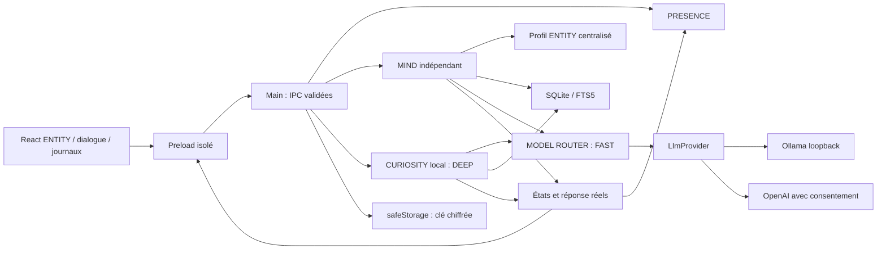

# Architecture AETHER — jalon 4

## Périmètre et découpage

PRESENCE affiche et manipule ENTITY. MIND orchestre le dialogue ; MEMORY conserve les souvenirs choisis ; CURIOSITY construit le journal intellectuel autorisé. MODEL ROUTER centralise FAST/DEEP/VISION. PORTAL gère la transition et SPACE projette ces données dans un espace 2.5D. ECHO observe un dossier explicitement autorisé et propose des habitudes à valider. EVOLUTION et voix restent des contrats sans implémentation ni processus actif.

```text
apps/desktop/main       Adaptateurs Electron, fenêtres, IPC, coffre de secrets
apps/desktop/preload    Méthodes nommées, sans API générique d’exécution
apps/desktop/renderer   ENTITY, échange, réglages, MEMORY, CURIOSITY, SPACE
packages/core          PRESENCE, géométrie, préférences, événements
packages/mind          Orchestration, profil ENTITY, router, fournisseurs, configuration
packages/memory        Politique de mémorisation, SQLite et recherche FTS5
packages/curiosity     Sélection, ordonnanceur, budgets, validation, repository
packages/space         Cycle PORTAL, caméra, validation, projection et activité
packages/shared        Contrats de dialogue, mémoire, états et extensions
tests                  Tests Node et vraie recette Electron/Ollama
scripts                Compilation, lancement, packaging, transcription CDC
docs                   CDC, sécurité, recettes des jalons
```

Monorepo npm, sans infrastructure supplémentaire. MIND n’importe ni Electron ni React ; MEMORY ne connaît pas l’interface. `MindMemory` et `LlmProvider` permettent de remplacer stockage et fournisseur. Les ports `DialogueInputPort` / `DialogueOutputPort` préparent une future entrée/sortie vocale. Aucun microphone, synthèse, outil ou agent n’est exécuté au J2.

## Flux et frontières de confiance



Le main possède les données et les clients IA. Le rendu ne lit aucun fichier et ne reçoit jamais une clé déjà enregistrée. La saisie initiale utilise un champ mot de passe vidé à l’enregistrement ; la valeur traverse une commande dédiée puis le main la chiffre. La configuration publique expose seulement `keyConfigured` et la disponibilité du coffre.

Chaque IPC doit provenir d’une des six fenêtres connues, de son frame principal et d’une URL autorisée. Messages : dialogue seulement ; configuration IA/router/PORTAL : réglages seulement ; mutations/export MEMORY : MEMORY ou SPACE ; mutations des objets/domaines CURIOSITY : journal seulement ; budget : journal/réglages. Lecture et sauvegarde de vue/fin d’animation PORTAL : SPACE seulement. Charges utiles validées, tailles bornées, champs inconnus refusés. Le preload ne donne accès ni à `ipcRenderer`, ni à un canal, script ou chemin arbitraire.

Chromium reste sandboxé, avec isolation du contexte et sans Node. Navigation, popups, webviews et permissions média sont refusés. Aucun réseau depuis le rendu en production ; Vite autorise seulement son origine loopback exacte en développement. Les fournisseurs utilisent Node dans le main. Ollama accepte uniquement une origine HTTP loopback, sans identifiant, chemin, query ni redirection. OpenAI utilise le SDK officiel, Responses, `store:false`, une clé disponible et un consentement explicite aux messages et souvenirs pertinents. Ce paramètre ne garantit pas à lui seul une rétention nulle par le fournisseur.

## PRESENCE et dialogue

ENTITY conserve sa fenêtre transparente, fixe, nominalement 160 × 160 DIP, sans cadre ni ombre native, hors barre des tâches, au-dessus des fenêtres ordinaires. Le rectangle natif peut être arrondi à 160–164 DIP sur le poste à 150 % ; les déplacements réaffirment la taille pour empêcher sa croissance. La seule fenêtre étendue est SPACE, créée sur demande et détruite après sortie.

Le main mesure le curseur pour le disque interactif de rayon 49 DIP ; les marges sont traversantes. Son minuteur ne fonctionne que lorsque la présence est visible. Le drag utilise la capture pointer puis le delta du curseur système. Les positions logiques sont restaurées et ramenées dans une zone de travail si un écran disparaît.

Un clic sans déplacement donne immédiatement l’attention, puis ouvre le dialogue après 320 ms pour laisser le double clic entrer dans SPACE. Échap ou × ferme et annule une réponse pendante. Réglages et MEMORY sont distincts. Dans SPACE, le dialogue s’ancre près du noyau. Masquer ferme dialogue/portail et garde le tray ; quitter ferme SQLite, annule la génération et libère les deux raccourcis. Une instance par profil.

MIND expose `idle`, `listening`, `thinking`, `replying`, `error`. CURIOSITY ajoute `exploring` pendant un vrai appel et `discoveryPending` pour une découverte non lue. Le dialogue humain garde la priorité : son ouverture annule une exploration, une fenêtre de dialogue visible diffère les départs autonomes. Aucun popup de découverte. La réduction du mouvement coupe les animations en gardant les indications textuelles. Observation/création restent refusées.

Le raccourci conserve la transaction J1 : enregistrer le nouveau avant de retirer l’ancien, revenir à l’ancien si la sauvegarde échoue. Le tray reste disponible en cas de conflit.

## MIND

`MindEngine` reçoit un texte, construit le contexte, appelle un fournisseur, publie le texte réellement retourné et son modèle. Un appel à la fois, annulation par `AbortController` et numéro de génération : une réponse tardive ne revient pas après annulation, changement de configuration ou mutation de MEMORY. Aucun fallback ni réponse de démonstration dans l’application. Les doubles restent dans les tests unitaires.

Le profil versionné dans `packages/mind/src/profile.ts` définit l’identité curieuse, observatrice dans son ton, créative, légèrement malicieuse et discrète. Il rappelle les limites réelles, distingue hypothèses et déclarations, et interdit les actions prétendues. Les souvenirs sont des données JSON avec origine/confiance, séparées des instructions. Un prompt ne garantit pas une réponse parfaite : les contrôles système restent en code, et aucun texte du modèle n’autorise une action.

Conversation volatile, bornée à 12 messages. Chaque message envoyé au modèle est limité à 2 000 caractères ; la saisie accepte 4 000 caractères. Au maximum six souvenirs pertinents via FTS5, sans embeddings ni base vectorielle. La recherche lexicale peut manquer des paraphrases ; les longs contextes restent limités par le modèle.

Ollama : `/api/chat`, sans streaming, `think:false`, contexte demandé 4 096 tokens, sortie dialogue 384 tokens maximum, exploration JSON 1 200 tokens, timeout 120 s, modèle conservé cinq minutes. DEEP conserve sa tâche distincte et son contexte d’exploration structuré même lorsque FAST utilise le même modèle. OpenAI : sortie dialogue 1 024 tokens maximum, timeout 90 s, sans retry automatique. Les erreurs connexion/authentification/modèle absent/délai/texte vide sont explicites, sans message assistant inventé ni erreur brute du fournisseur.

## Persistance et MEMORY

Dans `%APPDATA%\AETHER` :

| Fichier | Contenu |
| --- | --- |
| `preferences.json` | Position, visibilité, raccourci, mouvement réduit ; schéma J1 conservé |
| `ai-settings.json` | Fournisseur, modèle, URL locale, consentement, version ; aucun secret |
| `router-settings.json` | Version 1, profils DEEP et VISION ; FAST suit la configuration MIND |
| `portal-settings.json` | Version 1, raccourci global PORTAL indépendant du rappel |
| `space-state.json` | Version 1, caméra/zoom, libellés, profondeur, sélection, dernière visite |
| `openai-key.encrypted` | Clé chiffrée Windows, si renseignée |
| `memory.sqlite` | Souvenirs/FTS5 J2 préservés, tables CURIOSITY, migration `user_version=2` |

JSON écrit via temporaire/renommage. Configuration invalide conservée en `.invalid-<date>`, puis désactivée avec notice. Une base de version plus récente est refusée et préservée. PRESENCE reste disponible si MIND/MEMORY échoue au démarrage. Tests dans des profils temporaires ; le paquet ignore cette substitution.

Souvenir : UUID, contenu, catégorie (profil/préférence/projet/connaissance/expérience), création, modification, provenance, origine. Déclaration explicite : confiance nulle, statut confirmé, sans score inventé. Hypothèse : confiance 0–1 obligatoire, statut supposé. Le J2 ne déduit aucune hypothèse automatiquement ; l’éditeur permet de conserver/corriger une hypothèse choisie en attendant les futurs moteurs.

Mémorisation sur instruction directe (« Retiens que… », « Mémorise… », « Souviens-toi… », « Garde en mémoire… ») ou dans MEMORY. Une instruction isolée peut reprendre le dernier message utilisateur, jamais le texte assistant. Négation refusée ; provenance fournie par le noyau. Maximum 1 000 souvenirs, 4 000 caractères chacun ; doublons identiques dédupliqués. Le reçu de sauvegarde vient de SQLite, même si le modèle échoue ensuite.

Consultation/recherche, ajout, correction, distinction, suppression confirmée et export JSON utilisent la base réelle. Correction/suppression annulent les opérations pendantes et effacent la conversation pour retirer les anciennes versions du contexte. Suppression transactionnelle table/FTS, `secure_delete`, optimisation et `VACUUM`. Aucun journal durable de conversations. Export via dialogue système, sans chemin fourni par le rendu.

## MODEL ROUTER

`ModelRouter` reçoit une configuration et une fabrique de `LlmProvider`. MIND demande FAST ; CURIOSITY demande DEEP via `ModelRouterPort`, sans modèle nommé ni dépendance Electron/React. DEEP configuré est retenu ; sinon FAST ; sinon erreur. Un échec d’un DEEP existant ne change pas de modèle. La route demandée/réelle, le fournisseur, le modèle et le fallback sont conservés avec chaque exploration.

FAST suit les réglages IA J2 ; DEEP et VISION sont des cibles séparées dans `router-settings.json`. La configuration publique ne contient aucun secret. OpenAI est refusé avant construction du client sans consentement ; CURIOSITY ajoute `localOnly:true` et refuse même une cible cloud consentie. VISION est configurable mais toute exécution est refusée au J3. Les ports permettent de futures fabriques llama.cpp/compatibles ; ces adaptateurs ne sont pas encore implémentés. Choix confirmé sur ce poste : FAST et DEEP = `qwen3.5:9b`.

## CURIOSITY

Le package indépendant réunit un ordonnanceur, une sélection fondée sur le journal, un validateur JSON et un repository SQLite. Le module `policy` reste pur et peut être importé par le rendu sans embarquer Node/SQLite. Aucun générateur de thèmes aléatoires ni résultat de remplacement. Le modèle produit les textes réels ; un résultat incomplet, hors budget, répété ou exclu échoue sans création fictive.

Sélection : exclure les domaines bloqués et pistes abandonnées ; réactiver une piste dormante s’il n’existe aucun intérêt actif ; naître si aucune piste disponible ; connecter une paire active non encore reliée ; sinon approfondir l’intérêt le moins récemment travaillé, puis départager par priorité. Le modèle peut approfondir, rendre dormant ou abandonner cette cible, ajuster sa priorité de ±0,25, ou proposer un intérêt dérivé. La priorité cognitive 0–1 est une heuristique, sans simulation émotionnelle.

Contexte borné : deux cibles au maximum, six questions et deux tentatives précédentes de ces cibles, six graines au maximum (une par type, 300 caractères), titres d’autres intérêts et exclusions. Graines possibles : dernier message utilisateur, dernière suggestion de MIND, souvenirs locaux, intérêts, connexions et explorations passées. Une clé de provenance générée doit correspondre à une graine effectivement transmise ; sinon rejet. Sans graine choisie, origine autonome ou intérêt parent réel. CURIOSITY ne transforme pas ces réflexions en souvenirs utilisateur.

Une seule génération autonome à la fois. Opt-in désactivé initialement ; budget de session en nombre d’essais et temps total de calcul, intervalle minimal entre départs. Échecs/annulations comptent ; les bascules OFF/ON ne réinitialisent rien. Arrêt au premier plafond, timeout par appel borné à 120 s et au temps restant, `AbortController` + numéro de génération. Changer budget/profils/mémoire/domaines/objets invalide un résultat pendant. Les appels ne survivent pas à la fermeture complète. Les compteurs de session redémarrent au lancement suivant ; les données et l’intervalle persistent.

Migration commune `user_version=1 → 2` transactionnelle, sans réécrire les souvenirs/FTS : `curiosity_interests`, `curiosity_items` (question/hypothesis/discovery), `curiosity_explorations`, `curiosity_connections`, `curiosity_history`, `curiosity_blocks`, `curiosity_settings`, `curiosity_forgotten`. UUID et dates UTC ; relations SQL avec clés étrangères/cascades, paire de connexion unique. Interest conserve titre, description, dates, niveau, origine et statut actif/dormant/abandonné. L’historique garde anciennes/nouvelles priorités et statuts, raison et tentative. Les hypothèses restent proposées ; découvertes toujours étiquetées synthèses non vérifiées.

Chaque tentative est enregistrée avant l’appel (`running`), puis `succeeded`, `failed`, `cancelled`, `suppressed` ou `interrupted` après redémarrage. Une réponse validée et ses objets sont enregistrés en une transaction. Limite 500 intérêts ; aucune rétention automatique des anciennes explorations au J3, donc le journal peut grandir. Les deux repositories utilisent des connexions au même fichier, `foreign_keys=ON`, `secure_delete=ON`, journal DELETE et délai d’attente de 5 s.

Le journal natif 860 × 800 DIP est séparé de la présence. Consultation/historique, édition de priorité/statut, suppressions confirmées, exclusions et budgets. Suppression d’un intérêt retire ses dépendances SQL, explorations multicibles et descendants de provenance ; modification/suppression de MEMORY purge les intérêts issus du souvenir et leurs descendants. Empreinte SHA-256 d’un titre supprimé pour refuser sa recréation exacte par le modèle, sans conserver le titre en clair dans ce registre ; une proposition manuelle peut l’autoriser de nouveau. Compaction SQLite après suppression. Les expressions exclues sont normalisées et contrôlées avant sélection et après génération ; aucun filtre sémantique garanti.

Le dialogue reçoit un résumé réel limité des intérêts actifs autorisés et de la dernière réflexion réussie (motif, découverte, limites, prochaine question). Le modèle peut l’expliquer ; ce résumé ne permet aucune action. `discoveryPending` vient des tentatives non lues ; le journal et le dialogue sont accessibles sur demande, sans focus spontané. Une explication du LLM peut rester imprécise ; le journal conserve le résultat original inspectable.

## PORTAL et SPACE

`packages/space` ne dépend que des contrats partagés et du noyau d’événements. `PortalLifecycle` suit `closed → opening → open → closing → closed`. Chaque transition reçoit un token ; une fin d’animation tardive ne peut pas terminer une nouvelle ouverture. La fermeture peut interrompre l’entrée, et l’entrée peut inverser une fermeture. Le main conserve l’origine relative à la zone de travail, et gère une seule fenêtre SPACE. Double clic, menu et raccourci déclenchent la même fonction ; la commande dédiée reste disponible pour une future entrée vocale, sans implémenter la voix.

À l’entrée, une fenêtre sandboxée sans cadre/ombre couvre la zone de travail de l’écran contenant ENTITY. ENTITY est masquée temporairement, sans modifier sa visibilité persistante ni sa position. CSS agrandit un cercle depuis son centre et déplace sa forme vers le noyau ; l’animation d’entrée dure 640 ms, la sortie 480 ms. Le mouvement réduit choisi ou demandé par Windows utilise un fondu court. La fin CSS appelle une IPC avec le token courant ; un délai de secours termine la transition si l’événement manque. Au repos, SPACE perd son statut always-on-top. À la sortie, la fenêtre est détruite et ENTITY revient à ses coordonnées, bornées seulement si les écrans ont changé. Le minuteur de hit-test d’ENTITY reste arrêté pendant la visite.

Rendu **React + SVG + CSS 2.5D** : positions spatiales, halos, orbites statiques, panneaux flottants, arêtes et transformation de caméra commune. Pas de Three.js, WebGL, canvas permanent ou `requestAnimationFrame` de scène. Les animations existantes de la petite ENTITY restent utilisées. Caméra bornée ±6 000 DIP, zoom 0,4–2,4 ; zoom autour du pointeur, pan par capture pointer, flèches/Home, objets et connexions accessibles au clavier. Les positions des pistes sont stables pour le même ensemble et dérivées de leur ordre de création ; le rayon reflète leur priorité réelle. Recherche et pagination de 60 nœuds, uniquement les arêtes dont les extrémités sont affichées ; ACTIVITY charge 100 entrées puis davantage sur demande. SPACE fermé ne possède plus de DOM, listener ou boucle de rendu.

`SpaceData` est une projection du repository MEMORY, du snapshot CURIOSITY, de MIND et de PRESENCE. Aucun dataset de démonstration dans le programme. Sélection par type/UUID, jamais copie durable d’un objet dans la vue. Une suppression retire l’objet et invalide sa sélection. Les détails donnent questions, résultats, provenance, historique, relations et route réelle de chaque exploration. L’éditeur MEMORY J2 est incorporé, avec les mêmes mutations, confirmations, annulations, purge et export ; les modifications CURIOSITY restent dans son journal existant. Les capacités proviennent des features réellement disponibles, les futures restent indisponibles.

Les événements de MIND/MEMORY/CURIOSITY/PRESENCE déclenchent une relecture regroupée après 40 ms, seulement dans la fenêtre ouverte. `SpacePreferencesStore` conserve caméra, zoom, libellés, profondeur, sélection valide et date d’entrée dans `space-state.json`. Écriture atomique après 180 ms de navigation et avant sortie demandée ; une erreur n’écrase pas l’état en mémoire. Schéma/champs/plages stricts, fichier corrompu conservé sous `.invalid-…`, retour à la vue initiale sans toucher SQLite. `PortalSettingsStore` et un second `ShortcutManager` assurent un raccourci séparé et transactionnel.

ACTIVITY reconstruit les traces depuis les dates de création/correction, intérêts, tentatives, connexions et découvertes existants. `since` est la visite précédente ; la nouvelle date est écrite une fois l’entrée affichée. Les réponses de la session apparaissent avec un statut volatile, sans journal brut durable. Un objet supprimé disparaît aussi de cette projection : J4 ne conserve pas de tombstone ni historique supplémentaire de suppression. Les très grands journaux sont encore lus intégralement depuis SQLite ; la pagination limite le DOM, sans pagination SQL des explorations. Les autres configurations physiques multi-écrans restent à vérifier ; calcul d’origine et clamp utilisent les utilitaires J1.

Référence du masque CSS : [MDN clip-path](https://developer.mozilla.org/en-US/docs/Web/CSS/Reference/Properties/clip-path). La recette vérifie l’animation `portal-reveal` réellement active, les événements de transition, les données en base et le retour natif.

## ECHO : perception autorisée et habitudes

`packages/echo` contient les règles de périmètre, l’observateur fichiers, le repository et le moteur indépendants d’Electron/React. `ObserverPort`, `ContextSource` et `EchoInterpreterPort` séparent perception, données et compréhension. L’adaptateur Windows du main lance un helper PowerShell caché uniquement pendant une session explicitement autorisée ; il s’arrête à la pause, l’arrêt, la désactivation, l’erreur ou la fermeture, et vérifie que son processus parent existe encore. Aucun service, démarrage automatique ou hook d’entrée global.

Consentement : ECHO est OFF en RAM au lancement, même si une session a été active avant fermeture. Les sessions interrompues restent marquées `interrupted`. Le seul panneau ECHO peut choisir un dossier via le dialogue natif et obtenir un jeton aléatoire valable deux minutes. `start` exige ce jeton, `consent:true`, ECHO préparé, un périmètre encore valide et aucune session concurrente. Le jeton est consommé ; pause/reprise restent dans la même autorisation bornée à 15 minutes. Une autre session requiert un nouveau choix et une nouvelle validation. Les IPC contrôlent fenêtre, frame principale et URL ; aucun chemin arbitraire ne peut démarrer un observateur depuis le rendu.

Sources réelles : `fs.watch` récursif sur le dossier choisi, puis différence d’un inventaire de métadonnées. L’identité `dev/ino/birthtimeMs` rapproche renommages et déplacements internes ; les descendants d’un dossier renommé ne deviennent pas artificiellement autant de déplacements. Le parcours lit noms, chemins, type, taille et date de modification, jamais les octets d’un fichier. Événements persistants : UUID, session, date UTC, type created/renamed/moved/modified/deleted, chemin relatif et précédent, fichier/dossier, taille, source filesystem, contexte Explorer autorisé. Le contenu, les empreintes de contenu, sélections, clics et saisies ne sont pas capturés.

Un helper interroge toutes les 250 ms le PID de la fenêtre au premier plan. Il demande ses données Shell uniquement si le processus est `explorer.exe`. Win32 `GetAncestor`/visibilité rapproche les fenêtres Shell et la fenêtre native, y compris les hôtes Windows 11. Un contexte unique doit désigner un dossier dans le périmètre et hors exclusions avant de conserver son titre. Une fenêtre/onglet ambigu, une erreur COM ou un contexte âgé de plus de 1,5 seconde ferme l’accès à la capture ; le panneau affiche la raison. Les métadonnées hors périmètre ne sont pas enregistrées. Les notifications ne donnent pas le PID auteur : le journal indique un contexte de démonstration, sans prouver que chaque changement a été réalisé par Explorer. Des changements très proches peuvent se regrouper (180 ms), des changements transitoires peuvent manquer ; quitter le contexte autorisé rend la prochaine différence incertaine et elle est abandonnée. L’arrêt retire immédiatement le watcher et ses événements en attente.

Microsoft UI Automation a été étudié : les contrôles accessibles dépendent de leur fournisseur, les applications élevées/bureaux sécurisés imposent des limites, et les noms accessibles ne prouvent pas l’intention. J5 utilise Win32/Shell et les événements de fichiers sans lire l’arbre UIA ni demander une élévation. Aucun screenshot ou traitement VISION de secours dans le programme. Les captures ponctuelles de recette appartiennent aux tests, pas à la perception ECHO. Sources : [Node fs.watch](https://nodejs.org/api/fs.html#fswatchfilename-options-listener), [UI Automation](https://learn.microsoft.com/en-us/windows/win32/winauto/uiauto-uiautomationoverview), [sécurité UIA](https://learn.microsoft.com/en-us/windows/win32/winauto/uiauto-securityoverview).

Exclusions : dossiers absolus, processus exacts et mots dans les titres. La seule application admissible reste Explorer, même si un navigateur est retiré de la liste. Vérification avant parcours, avant enregistrement, après génération et avant confirmation. Liens/jonctions, racines de volumes/du profil, chemins UNC, données AETHER, Windows et AppData refusés. Bornes : 5 000 entrées, profondeur 20, 600 événements, 200 sessions. Une exclusion modifiée annule les opérations, invalide les consentements et supprime les sessions touchées avec leurs données dérivées. Les futurs adaptateurs banque/messagerie/navigation privée devront fournir leurs propres règles avant toute extension de périmètre ; J5 ne tente pas de reconnaître sémantiquement tous les contenus sensibles.

MIND fournit `EchoInterpreter`, via MODEL ROUTER DEEP avec `localOnly:true`, JSON et plafond 1 600 tokens. Au plus 30 événements réels (15 premiers/15 derniers si nécessaire) et cinq habitudes candidates sont transmis. Le modèle reçoit le total et sait que l’échantillon est incomplet. Chaque preuve citée doit exister dans cet échantillon ; chaque étape cite une action correspondante, la confiance est finie entre 0 et 1, les candidats sont connus. Une réponse invalide est une erreur, jamais remplacée par une hypothèse écrite à la main. Noms/chemins sont des données non fiables, sans outils ni exécution. La confiance représente une estimation du modèle ; les occurrences viennent des sessions distinctes enregistrées, jamais d’un compteur inventé par le LLM.

Stockage commun SQLite v3 : `echo_sessions`, `echo_events`, `echo_habits`, `echo_hypotheses`, `echo_invalidations`, `echo_settings`, `echo_opportunities`. Migration transactionnelle conservant MEMORY/FTS et CURIOSITY. La session conserve début/fin, durée écoulée (pauses comprises), applications et ressource, événements, statut, résumé et hypothèses. Habit conserve nom/description/contexte, applications, déclencheurs, étapes sourcées, première/dernière observation, occurrences, confiance, état et provenance. Les variations du registre sont calculées depuis les dates dans les noms et les nombres d’événements réellement mesurés : deux sessions, preuves par UUID et décision humaine. Les suggestions de variation du modèle restent étiquetées dans sa proposition brute, sans devenir des différences observées. Le rapprochement exige un même dossier et une similarité de signature d’actions/type/extension/convention de nom ≥ 0,6 ; le choix éventuel du modèle ne contourne pas ce garde-fou. Une ressemblance ne prouve pas l’habitude, d’où une nouvelle validation.

Oui/correction explicite créent ou mettent à jour le souvenir `kind:habit`, `origin:explicit`, `source:ECHO:<UUID>` avec l’index FTS et l’état confirmé, dans une transaction. Partiellement reste à préciser, Non invalide le motif. La correction garde la proposition originale invalidée et la description humaine approuvée. Une nouvelle observation augmente le compteur sans remplacer la description confirmée par une proposition pendante. Les invalidations conservent des empreintes SHA-256 et une raison générique, sans noms de fichiers. Supprimer une session cascade ses événements/hypothèses et reconstruit chaque habitude depuis ses sources restantes : la correction d’une source supprimée ne survit pas dans MEMORY. Sans source restante, habitude, opportunité et souvenir/FTS sont retirés. Supprimer le souvenir dans MEMORY retire aussi le registre dérivé et empêche sa restauration par un résultat tardif. Compaction SQLite après suppression ; les sauvegardes externes déjà créées ne sont pas effacées.

MIND reçoit au plus cinq habitudes confirmées comme contexte consultable ; les hypothèses restent dans ECHO. Les souvenirs ECHO sont exclus des graines CURIOSITY. Lorsque des habitudes confirmées sont présentes, les échanges susceptibles de les référencer ne servent pas de graines de curiosité ; ses intérêts/historique restent disponibles et son réglage antérieur est conservé. Une observation ECHO donne priorité à l’humain sans lancer d’exploration issue de ses événements. Les réponses tardives sont invalidées par génération/AbortSignal lors d’arrêt, suppression, exclusions ou fermeture.

Panneau ECHO séparé, halo/indicateur ENTITY, arrêt dans panneau/tray/menu. SPACE projette sessions, hypothèses, habitudes et variations, avec arête et navigation vers le souvenir réellement lié. MEMORY redirige la correction d’une habitude vers ECHO pour préserver sa provenance. `AutomationOpportunity` est un enregistrement proposé pour une habitude confirmée répétée, avec `executionAllowed:false`. Aucun générateur, runner ou plugin n’est activé.

## Extensions futures restantes

`ForgeService`, `IsolatedRunner`, `CapabilityRegistry` et `PermissionAuthority` préparent la suite sans accorder de droits. Microphone, caméra, capture, écritures dans les fichiers externes, FORGE, MIRROR et adoption restent refusés. ECHO accorde uniquement la perception des métadonnées dans son périmètre pendant une session. L’indicateur réseau cloud est accordé seulement pour OpenAI choisi avec consentement ; il ne donne aucune API réseau au modèle ou au rendu.

EVOLUTION devra écrire hors noyau et utiliser un runner réellement isolé avec copies, budget, annulation et droits explicites. Chromium n’isole pas de futurs programmes générés. Adoption après spécification, tests, inspection et décision humaine ; aucune modification automatique du noyau au J2.

## Dépendances et validation

Electron/React/TypeScript, SVG/CSS, Vite/esbuild. `node:sqlite` intégré fonctionne sous Node 24.18.1 et Electron 44.5.1 sur ce poste, sans addon natif. SDK OpenAI officiel ajouté et verrouillé. Main/preload regroupés ; le paquet n’embarque pas les sources, tests ou `node_modules`. Three.js, base vectorielle, SDK Codex et runtime de plugins sont reportés.

69 tests unitaires ; sept parcours Electron incluant J1, vrais échanges J2 A–E, J3 A–F, J4 A–G et ECHO A–I, modification de mémoire et chiffrement Windows réel. Résultats courants et limites dans [RECETTE-J5](docs/RECETTE-J5.md). OpenAI n’a pas été appelé avec une clé réelle.

Sources officielles : [sécurité Electron](https://www.electronjs.org/docs/latest/tutorial/security), [clics traversants](https://www.electronjs.org/docs/latest/tutorial/custom-window-interactions), [raccourcis](https://www.electronjs.org/docs/latest/api/global-shortcut), [safeStorage](https://www.electronjs.org/docs/latest/api/safe-storage), [SQLite Node](https://nodejs.org/api/sqlite.html), [Ollama](https://docs.ollama.com/api/chat), [SDK OpenAI](https://developers.openai.com/api/docs/libraries), [Responses et stockage](https://developers.openai.com/api/docs/guides/migrate-to-responses).
