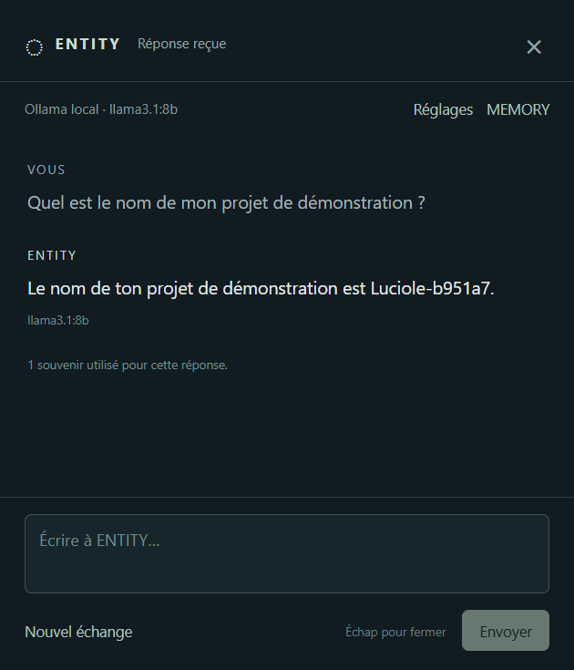
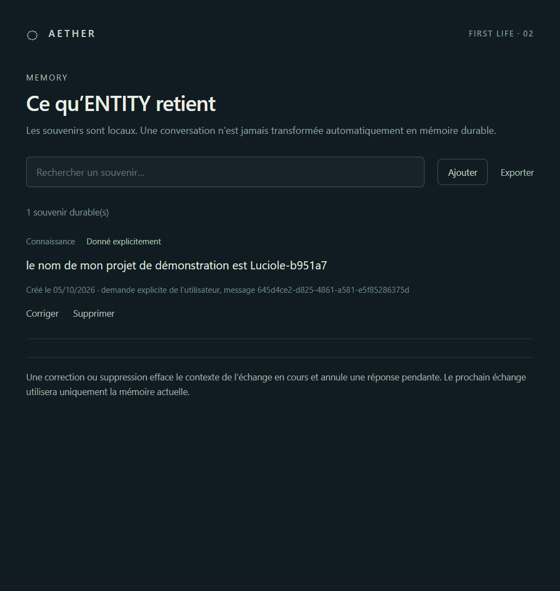
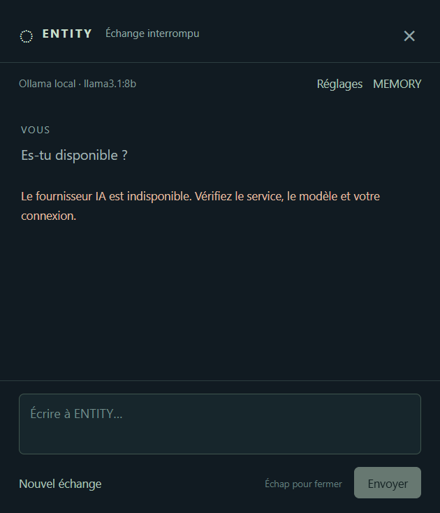

# Recette J2 — MIND + MEMORY

Réalisée le 5 octobre 2026 sous Windows 11 x64, affichage à 150 %, Node 24.18.1 et Electron 44.5.1. Version livrée : 0.2.0. Le fournisseur choisi par l’utilisateur est **Ollama local**, `llama3.1:8b`, à `http://127.0.0.1:11434` ; aucune clé, aucun appel cloud. Les modèles étaient déjà installés, aucun téléchargement ajouté.

Le plan a été mis à jour avant développement. CDC, architecture, plan et code J1 relus ; aucun travail engagé sur ECHO, CURIOSITY, FORGE, MIRROR, portail/SPACE ou voix.

## Résultats des contrôles

| Contrôle | Résultat |
| --- | --- |
| `npm run typecheck` | Réussi |
| `npm test` | 25 tests réussis, dont les 12 J1 conservés |
| `npx playwright test` après compilation | 4 parcours réussis, 23,8 s dans la recette finale |
| `npm run package:win` | Paquet Windows x64 0.2.0 construit |
| `node scripts/verify-package.mjs` | Paquet réellement lancé, `app.isPackaged=true`, IA locale, réponse réelle |
| Contrôle visuel | Captures dialogue, MEMORY, réglages, réflexion et erreur inspectées |

Le test J1 natif conserve transparence/clics traversants, vrai drag, position, raccourci global, conflit de raccourci, mouvement réduit, masquage/rappel, taille stable, sécurité IPC et redémarrages. Seuls les résultats attendus des nouveaux modules et l’ouverture du dialogue au clic ont été adaptés ; les contrôles J1 n’ont pas été supprimés. [RECETTE-J1](RECETTE-J1.md) est conservée comme historique.

## A–E avec une vraie IA

Recette Electron exécutée de 06:19:49 à 06:19:56 UTC (08:19 à Paris). Les réponses ci-dessous viennent du service Ollama réel, sans interception ni fournisseur factice. [Preuve JSON complète](recette-j2/preuve-reelle.json) : dates, UUID, modèle, souvenir, réponses et erreurs.

| Test | Action et résultat réel |
| --- | --- |
| A — identité | « Comment t’appelles-tu ? » → « Je m'appelle ENTITY, la présence numérique d'AETHER. » Modèle `llama3.1:8b`. |
| B — souvenir et redémarrage | « Retiens que le nom de mon projet de démonstration est Luciole-b951a7. » Reçu SQLite, origine explicite, confiance nulle, provenance du message utilisateur. Fermeture complète, relancement du même profil, conversation vide. « Quel est le nom de mon projet de démonstration ? » → « Le nom de ton projet de démonstration est Luciole-b951a7. » UUID retrouvé dans le contexte mémoire. |
| C — suppression | MEMORY affiche le souvenir avec origine/date/source. Supprimer puis Confirmer : liste et base actives vides, contexte effacé. Même question → « Je ne connais pas ce projet de démonstration. » Aucun souvenir utilisé, aucun retour du marqueur supprimé. |
| D — état visuel | Pendant A, état PRESENCE `thinking` et indication « Le modèle prépare sa réponse… » vérifiés avant la réponse. Capture de la vraie fenêtre pendant l’appel ; retour à un état attentif après réception. |
| E — erreurs | IA désactivée : « Aucune IA n’est configurée. Choisissez un fournisseur et un modèle dans les réglages. » Puis URL Ollama configurée sur un port loopback fermé : « Le fournisseur IA est indisponible. Vérifiez le service, le modèle et votre connexion. » Dans les deux cas, zéro message assistant, aucune réponse de substitution. |







L’état réfléchi est également conservé dans [la capture d’ENTITY](recette-j2/entity-reflexion.png). Ces images proviennent du profil temporaire de recette, pas des données personnelles.

## MEMORY, configuration et sécurité

- Aucun souvenir ajouté par le dialogue ordinaire ; mémorisation sur demande directe ou ajout dans MEMORY.
- Ajout d’une hypothèse avec confiance 0,65 dans l’interface, puis correction de son contenu et conversion en déclaration explicite : libellés et SQLite mis à jour ; conversation effacée.
- Recherche FTS testée avec accents, entrée hostile, correction retirant l’ancien contenu et suppression retirant la ligne et l’index. Redémarrage du stockage conserve les métadonnées. Une version de schéma trop récente est refusée sans écraser son contenu.
- Suppression effective, index compacté et absence du contenu supprimé dans le fichier de base de test vérifiés. Aucun journal ou table de conversation durable.
- Annulation, refus de requêtes simultanées et rejet d’une réponse tardive après suppression/changement de contexte vérifiés avec des doubles limités aux tests unitaires.
- Coffre `safeStorage` réel Windows : clé de test non utilisable chiffrée, contenu absent du JSON et du fichier binaire en clair, déchiffrement par le main vérifié sans renvoi de la clé, champ UI vidé, persistance après redémarrage et suppression effective. Aucun appel envoyé avec cette clé.
- Consentement cloud désactivé : demande bloquée avant le fournisseur, malgré la présence de la clé de test. Configuration publique sans `apiKey`.
- OpenAI Responses : SDK réel, contrat `store:false`, extraction du texte et erreurs assainies testés par transport de test. Aucun appel OpenAI authentifié n’a été validé.
- Échap ferme effectivement le dialogue, sans faire disparaître ENTITY.

Export JSON disponible via le dialogue de sauvegarde système ; les enregistrements exportables du repository sont testés. La manipulation manuelle de cette fenêtre native de sauvegarde n’est pas présentée comme un parcours automatisé validé ici.

## Paquet et profil du poste

`release\AETHER-win32-x64\AETHER.exe`, version 0.2.0 : paquet vérifié avec archive de 14 entrées, sans sources, tests ni `node_modules`. Il contient main/preload compilés et SDK intégré ; SQLite vient du runtime Electron.

À 06:32:18 UTC, l’exécutable packagé a répondu à la même question : « Je m'appelle ENTITY, je suis la présence numérique d'AETHER. » Configuration réellement relue : Ollama / `llama3.1:8b`, cloud désactivé, aucune clé. Position J1 conservée (68, 746 DIP), raccourci Ctrl + Alt + Espace enregistré. Le profil personnel contient **zéro souvenir de démonstration** ; les tests utilisent des profils temporaires supprimés ensuite.

Après vérification du paquet, AETHER est relancé normalement pour rester disponible sur le bureau. Cliquez sur ENTITY pour écrire ; MEMORY s’ouvre depuis l’échange, le tray ou les réglages.

## Rejouer la recette

Quittez l’instance personnelle pour libérer le raccourci global. Démarrez Ollama avec `llama3.1:8b` présent, puis :

```powershell
npm run check
```

Le parcours natif déplace réellement le curseur et presse des touches ; les quatre tests Electron utilisent un seul worker. A–E exigent le service/modèle réels, sans fallback. Captures/preuve JSON/traces éventuelles sont produites dans `test-results/` (exclu de Git). Les doubles sont uniquement dans les tests unitaires, pour les échecs et courses difficiles à reproduire.

## Limites et jalon proposé

Réponses non streamées ; le premier chargement froid du modèle a pris environ 40 s dans la sonde initiale. Délai maximum local 120 s. Latence et justesse dépendent du poste/modèle. Recherche lexicale, six souvenirs maximum, contexte de 12 messages et limites de taille : certaines paraphrases/longs échanges peuvent manquer. Le profil ne garantit pas l’absence de toute hallucination.

Pas de mémoire automatique des habitudes ni de déduction autonome. Hypothèses explicitement choisies dans l’éditeur. Souvenirs/exports non chiffrés, clé chiffrée Windows ; garanties et frontières dans [SECURITE](SECURITE.md). Adaptateur OpenAI implémenté mais accès réel non validé sans clé ; llama.cpp, outils et agents restent futurs. Autres topologies physiques d’écrans/DPI non testées au-delà de cette configuration.

Voix, dépôt de fichier, portail/SPACE, ECHO, CURIOSITY et EVOLUTION restent non implémentés. La réception FIRST LIFE complète n’est donc pas revendiquée. Proposition : **J3 PORTAL + SPACE**, après validation de ce jalon. Développement arrêté à J2 ; aucun jalon suivant engagé.
