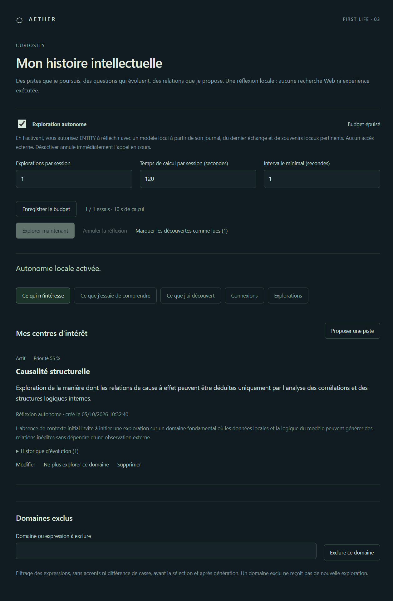
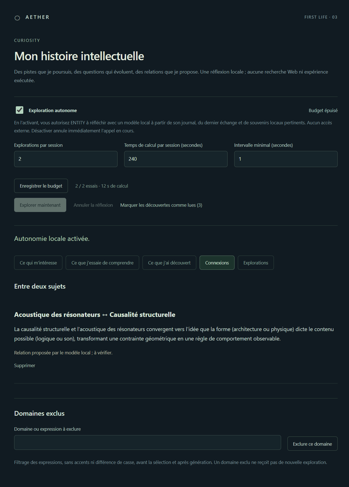
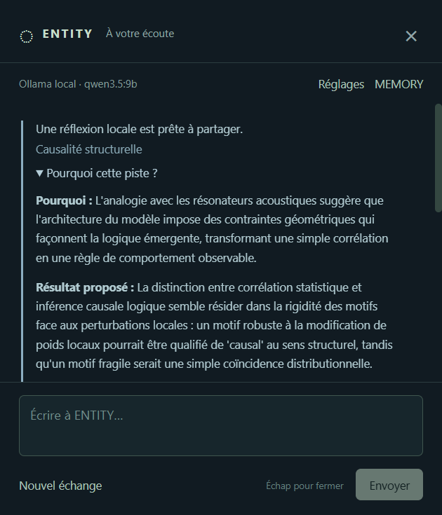

# Recette J3 — CURIOSITY + MODEL ROUTER

Réalisée le 5 octobre 2026 sur Windows 11 x64, affichage à 150 %, Node 24.18.1 et Electron 44.5.1. Version : **0.3.0**. Choix confirmé par l’utilisateur : **FAST = DEEP = Ollama / `qwen3.5:9b`**, `http://127.0.0.1:11434`. Aucun modèle téléchargé, aucune clé ni demande cloud.

CDC, PLAN, ARCHITECTURE et recettes J1/J2 relus avant modification ; plan J3 écrit avant implémentation. Les recettes précédentes sont conservées comme historiques. Aucun développement de PORTAL, SPACE, ECHO, FORGE, MIRROR ou voix.

## Contrôles

| Contrôle | Résultat |
| --- | --- |
| `npm run typecheck` | Réussi |
| `npm test` | 44 tests réussis ; 25 tests J1/J2 conservés et 19 tests J3 |
| `npm run check` | Réussi ; cinq parcours Electron en 55,9 s dans la validation finale |
| J1 natif | Clics traversants, vrai clic central/drag, raccourcis/conflit, mouvement réduit, taille, masquage/rappel, IPC et redémarrages |
| J2 réel | Identité, souvenir/reprise après redémarrage, suppression/correction, état thinking, erreurs de configuration/connexion avec `llama3.1:8b` |
| Coffre Windows | Chiffrement `safeStorage`, absence de secret dans JSON/rendu, reprise et suppression, cloud refusé sans consentement |
| J3 réel | Six scénarios A–F ci-dessous avec `qwen3.5:9b`, état exploring et partage d’un résultat réel |
| `npm run package:win` | Paquet Windows x64 0.3.0 construit |
| `node scripts/verify-package.mjs` | Réussi ; paquet réellement lancé, réponse Ollama et profil relus |
| Contrôle visuel | Journal, connexion, découverte, original partagé et configuration packagée inspectés |

La fenêtre native de test J1 est maintenant placée explicitement au-dessus des autres fenêtres du bureau, puis ENTITY au-dessus de cette cible. Un clic dans sa marge active la cible, donc ENTITY est remise au-dessus avant le contrôle central. Ce réglage de la fixture conserve toutes les assertions et le véritable input Windows ; il évite que l’ordre des fenêtres extérieures fausse la recette.

Les tests unitaires utilisent des doubles pour les courses/échecs reproductibles ; les recettes Electron J2/J3 appellent le vrai service Ollama, sans interception ni réponse prédéfinie. Profils temporaires supprimés après tests. [Preuve complète J3](recette-j3/preuve-reelle.json) : UUID, dates, objets, historique, routes, résultats et états avant/après redémarrage/suppression. Les sujets générés peuvent différer à chaque exécution.

## A–F

| Test | Parcours et vérification |
| --- | --- |
| A — naissance/persistance | Profil vide, FAST/DEEP configurés dans les réglages, autonomie activée avec un budget d’un essai. Le timer produit un intérêt, une question, une hypothèse et une découverte, origine autonome. Fermer complètement puis relancer le même profil : UUID, objets, historique et configuration identiques. Aucun sujet pré-écrit ni message utilisateur. |
| B — continuité | Réactiver avec un essai autorisé dans la nouvelle session. La tentative cible l’UUID de A, produit une question différente liée à cet intérêt et conserve l’évolution de priorité/statut. |
| C — sérendipité | Proposer une seconde piste dans l’interface : « Acoustique des résonateurs ». Autoriser un essai supplémentaire. Le moteur choisit deux pistes actives différentes et le modèle propose une relation nouvelle, enregistrée avec leurs UUID et sa tentative source ; visible dans Connexions. |
| D — autonomie | Augmenter le budget : une nouvelle réflexion part par ordonnanceur sans message, ni clic sur Explorer maintenant. Quatre tentatives réussies au total sur les deux sessions ; zéro message MIND avant l’échange de partage. |
| E — transparence | Consulter l’intérêt de A puis Supprimer/Confirmer dans le journal. Son UUID quitte les intérêts, ses questions/découvertes et explorations liées sont retirées, connexions et descendants de provenance purgés, contexte MIND effacé. Aucune piste supprimée ne reste active. |
| F — arrêt | Désactivation explicite, tentative manuelle refusée, observation pendant 2,5 s avec un intervalle de recette de 1 s : aucune tentative supplémentaire. L’annulation pendant un appel et le rejet des réponses tardives sont aussi testés unitairement. |

Le temps maximal de recette est 120 à 360 s selon l’étape ; intervalle réduit à 1 s uniquement dans le profil temporaire. Le profil personnel garde les limites initiales et l’autonomie désactivée.

Exécution finale J3 : **08:32:30–08:33:05 UTC** (10:32–10:33 à Paris). Intérêt créé par le modèle : **Causalité structurelle**, UUID `d00e8365-9402-4f63-bfbc-69366587a5c4`. Première question : « Comment la structure interne des connaissances peut-elle révéler des motifs cachés dans des concepts abstraits comme la causalité ou l’identité ? » Puis : « Dans quelle mesure les motifs récurrents dans les représentations latentes imitent-ils la causalité physique ou sont-ils des artefacts de la distribution d’entraînement ? » La connexion proposée avec l’acoustique porte sur les contraintes qu’impose une architecture à son comportement ; c’est une analogie à vérifier. Après E/F : l’UUID initial et les explorations liées sont absents, mode désactivé, aucune tentative créée par le lancement refusé ou pendant l’attente.

## Partage et commandes

Pendant l’appel local, `data-state=exploring` est vérifié sur la vraie fenêtre [ENTITY](recette-j3/j3-exploring.png). Une réussite active `discoveryPending`, sans ouvrir de fenêtre ni prendre le focus. Le journal permet de marquer les résultats lus ; le signal s’éteint.

À l’ouverture du dialogue, une indication discrète donne le sujet. « Pourquoi cette piste ? » affiche directement le motif, le résultat proposé et la prochaine question du journal original, avec ses limites. Ce contenu vient de SQLite et ne dépend pas d’une reformulation. Une question à MIND produit également une réponse FAST réelle, avec le résumé historique dans son contexte ; le modèle peut rester imprécis, le journal demeure la référence.

Exclusion de « robotique », affichage de la règle, puis réautorisation vérifiés dans l’interface. Le rendu ENTITY ne peut pas écrire les intérêts, exclusions ou profils : commandes refusées avant mutation. Sélection bloquée et sortie mentionnant un domaine interdit écartée sans conservation de son contenu, vérifiées unitairement.

## Router, budgets et persistance

- FAST et DEEP réellement sélectionnés ; DEEP absent utilise FAST ; aucune cible provoque une erreur. Un DEEP configuré ne déclenche aucun fallback de fournisseur en cas d’échec.
- Cloud non autorisé refusé avant construction du fournisseur ; CURIOSITY locale refuse aussi un cloud consenti. VISION reste réservé sans exécution. [Configuration réelle du paquet](recette-j3/paquet-profils.png).
- Migration SQLite v1 → v2 sur une base de test contenant un souvenir et son index FTS J2 : contenu/UUID préservés, nouveaux objets/historique/réglages durables après réouverture. Base plus récente refusée sans écrasement.
- Budgets de nombre, durée et intervalle appliqués aux lancements manuels et au timer. OFF/ON ne remet pas les compteurs à zéro. Timeout d’une seconde interrompt effectivement le transport de test. Activité humaine ne consomme aucun essai autonome.
- Diminution de priorité, dormance, réactivation puis abandon conservent les transitions dans l’historique. Les pistes abandonnées et exclues ne sont pas sélectionnées.
- Suppression de question/découverte/exploration vérifiée séparément ; suppression d’un intérêt d’origine mémoire purge aussi ses pistes dérivées. Une réponse tardive après annulation/suppression ne peut pas recréer la piste.
- Tentative `running` d’une session interrompue reprise comme `interrupted`, pas comme une réussite inventée. JSON invalide, décision incohérente, provenance inconnue ou répétition ne créent aucun résultat de remplacement.

## Livraison du poste

Profil existant sauvegardé avant migration dans `%APPDATA%\AETHER\backup-before-j3-20261005-101231` : préférences, configuration IA et SQLite J2. Les sauvegardes restent des copies historiques et ne sont pas effacées par les suppressions de la base active.

FAST/DEEP sont configurés sur le modèle choisi dans les vraies interfaces main/preload. Les préférences et souvenirs préexistants sont comparés avant/après. Le journal personnel ne reçoit pas les données de recette. L’autonomie reste désactivée : ouvrir CURIOSITY pour l’activer volontairement.

Exécutable : `release\AETHER-win32-x64\AETHER.exe`. Le dossier complet contient le runtime. Les sources, tests et `node_modules` sont exclus du paquet. Vérification par `scripts/verify-package.mjs` : version 0.3.0, vraie instance packagée, modèle local, quatre modules disponibles, sandbox, cloud désactivé, journal personnel vide et réponse d’identité réelle. Après ce contrôle, relancement normal sur le bureau.

À **08:35:54 UTC**, le paquet a répondu : « Je m’appelle ENTITY. Je suis la présence numérique d’AETHER. Comment puis-je t’aider aujourd’hui ? » Modèle réellement retourné : `qwen3.5:9b`. Archive de 14 entrées ; raccourci Ctrl + Alt + Espace enregistré, aucune clé, autonomie désactivée, zéro intérêt de démonstration. [Preuve de vérification du paquet](recette-j3/paquet-verifie.json).

## Rejouer et limites

Quitter l’instance personnelle pour libérer le raccourci. Ollama doit exposer `llama3.1:8b` (régression J2) et `qwen3.5:9b` (J3), puis exécuter `npm run check`. Les preuves/captures/traces sont générées dans `test-results/`. La recette native déplace le curseur et utilise les raccourcis du poste.

Les découvertes sont des synthèses/hypothèses du modèle ; aucun Web ni expérience ne les valide. Les analogies et scores peuvent être arbitraires ou erronés. Le moteur sélectionne une piste à partir de règles simples ; il n’est ni une conscience ni un chercheur disposant d’outils. Réponses non streamées, latence dépendante du modèle ; premier démarrage froid plus lent, timeout local 120 s.

La reformulation du modèle peut mal décrire le statut présent/passé ou abréger un identifiant malgré les consignes. Le détail original dans l’échange et les entrées MEMORY/CURIOSITY restent consultables pour contrôler ses affirmations ; aucun texte assistant n’est remplacé par une réponse factice.

Blocage lexical des expressions, pas de compréhension exhaustive des domaines/synonymes. Empreinte des titres supprimés contre la recréation exacte, sans garantie de reconnaître toutes les reformulations. Maximum 500 intérêts, historique des tentatives sans politique de rétention automatique ; croissance et navigation de très grands journaux restent à travailler. Budgets remis à zéro au redémarrage complet, intervalle conservé. Laisser le dialogue ouvert diffère les explorations.

SQLite et exports non chiffrés ; clé seule chiffrée Windows. Migration v2 irréversible par l’ancienne application J2 : revenir à J2 nécessite la sauvegarde préalable, l’ancienne version refuse le schéma plus récent. OpenAI implémenté/testé au protocole, non validé avec un compte réel ; llama.cpp et autres adaptateurs restent futurs. Aucun programme généré ou plugin chargé. Autres configurations physiques multi-écrans/DPI non validées au-delà du poste.

Proposition suivante : **J4 PORTAL + SPACE**, pour explorer spatialement les véritables intérêts, questions et connexions. Arrêt à J3 ; aucun jalon suivant engagé.
